# [Soulmachines](https://www.soulmachines.com/) Orchestration-fastapi

## Table of Contents

* [About Soulmachines](#about-soulmachines)
* [About Project](#about-project)
* [Directory Structure](#directory-structure)
* [How It Works](#how-it-works)

  * [1. Welcome](#1-welcome)
  * [2. Fallback](#2-fallback)
  * [3. Show Card](#3-show-card)
  * [4. Echo](#4-echo)
  * [Flowchart](#flowchart)
* [Code Modifications](#code-modifications)

  * [Fallback Responses](#fallback-responses)
* [Example of Raw Message Handling](#example-of-raw-message-handling)
* [ConversationRequest Handling](#conversationrequest-handling)
* [ConversationResponse Handling](#conversationresponse-handling)

  * [ConversationResponse Examples](#conversationresponse-examples)

    * [1. Initial Welcome](#1-initial-welcome)
    * [2. Echo Response](#2-echo-response)
    * [3. Show Card](#3-show-card-1)
* [Running The Code](#running-the-code)
* [Connecting on Soul Machine](#connecting-on-soul-machine)
* [Orchestration Settings](#orchestration-settings)

  * [Option 1: Globally](#option-1-globally)
  * [Option 2: Locally](#option-2-locally)
* [Deploying the Avatar](#deploying-the-avatar)
* [Important Tip](#important-tip)
* [License](#license)

---

## About Soulmachines

Soul Machines is a leading innovator in humanizing AI experiences. We leverage our cutting-edge, patented Biological AI technology to transform highly personalized digital connections with a commitment to making AI accessible and ethical for all.

## About Project

This repository contains an example orchestration server implementation using Python FastAPI. It is designed to act as a conversation server.

---

## Directory Structure

```
📦 soulmachines-orchestration-fastapi
┣ 📂 src
┃ ┣ 📜 controller.py
┃ ┣ 📜 models.py
┃ ┣ 📜 server.py
┃ ┗ 📜 __init__.py
┣ 📜 .env
┣ 📜 .gitignore
┣ 📜 LICENSE.txt
┣ 📜 pyproject.toml
┣ 📜 README.md
┗ 📜 uv.lock
```

---

## How It Works

In the code, we set up a Soul Machines orchestration endpoint that handles four cases:

### 1. Welcome

If the conversation has just started, the server replies with:

```txt
"Hi there!"
```

### 2. Fallback

If the incoming message starts with “why”, it replies with:

```txt
"I do not know how to answer that"
```

The response is flagged as a fallback (see “Fallback Responses” below).

### 3. Show Card

If the user says “show card”, the server returns a kitten image, for example:


### 4. Echo

For any other input, the server echoes back the user’s message:

```python
input = {"text": req.input["text"]}
output = {"text": f"Echo: {req.input['text']}"}
```

#### Flowchart

```mermaid
graph LR
    Client((Client)) -->|WebSocket| Server((FastAPI Server))

    subgraph Server
        WS[WebSocket /ws] --> Handler[Message Handler]
        Handler --> Builder[Response Builder]
        Builder --> WS
    end

    subgraph Cases
        Welcome[“Hi there!”]
        Fallback[“I do not know how to answer that”]
        Cards[Show kitten image]
        Echo[Echo user input]
    end

    Builder -->|kind=init| Welcome
    Builder -->|text starts with “why”| Fallback
    Builder -->|text is “show card”| Cards
    Builder -->|otherwise| Echo

    style Client fill:#81d4fa,stroke:#000000,stroke-width:1px,color:#000000
    style Server fill:#81d4fa,stroke:#000000,stroke-width:1px,color:#000000
    style Cases fill:#81d4fa,stroke:#000000,stroke-width:1px,color:#000000
    linkStyle default stroke:#ffffff,stroke-width:2px
```



---

## Code Modifications

You can customize responses by editing the `handle_request()` function in `src/controller.py`.

* **File:** `src/controller.py`
* **Function:** `handle_request()`

By default, it:

1. Checks if this is the first message and sends a welcome message.
2. Flags a fallback if the text starts with “why”.
3. Sends a kitten image if the text is “show card”.
4. Echoes the input otherwise.

### Fallback Responses

You can mark any response as a fallback. This is useful when using LLM-powered skills in your DDNA Studio project. If a fallback response is detected, the Soul Machines system can redirect the request to a fallback skill for a more appropriate answer.

Example in `controller.py`:

```python
# Flag fallback response (handled by skills in the project)
if req.input.text.lower().startswith('why'):
    resp.output.text = 'I do not know how to answer that'
    resp.fallback = True
```

---

## Example of Raw Message Handling

When the first raw message is received, it is being logged as:

```python
print("Raw message received:", raw)
```

The json returned will have following schema:

```python
class SMMessage(BaseModel):
    body: Dict[str, Any]
    category: str
    kind: str
    name: str
```

Example raw message JSON:

```json
{
  "body": {
    "session": {
      "meta": {
        "SessionOfferWaitTime": 0,
        "features": {
          "videoStartedEvent": true
        },
        "headers": {
          "Accept-Language": ["en-US,en;q=0.9"],
          "User-Agent": ["Mozilla/5.0 ... Safari/537.36"]
        },
        "keyName": "sm-ddna-fundamental--henryai",
        "publicDns": "dh-neu-prod-dp-vmss0003rw.az.sm-int.cloud",
        "redisKey": "dh-neu-prod",
        "region": "northeurope",
        "sceneId": 1,
        "server": "DH-NEu-Prod-DP-VMSS0003RW",
        "soulId": "ddna-fundamental--henryai",
        "user": {}
      },
      "sessionId": "01adf224-7d19-4ab4-935a-3f47b2250e10",
      "state": "offered",
      "userInfo": ""
    }
  },
  "category": "scene",
  "kind": "event",
  "name": "state"
}
```

> The `sessionId` will come in handy as this value will be sent to the browser when embedding your Soul Machine on your site.

---

## ConversationRequest Handling

When the first raw message is received, it is being logged as:

```python
if msg.name == "conversationRequest":
```

The json returned will have following schema:

```python
    class ConversationRequest(BaseModel):
        input: Dict[str, str]
        optionalArgs: Optional[Dict[str, Any]] = None
        variables: Optional[Dict[str, Any]] = None
```

Example `conversationRequest` JSON:

```json
{
  "body": {
    "input": {
      "text": ""
    },
    "optionalArgs": {
      "kind": "init",
      "speakResults": true
    },
    "personaId": "1",
    "variables": {
      "Current_Time": "11 44 in the morning",
      "FacePresent": null,
      "PersonaTurn_IsAttentive": null,
      "PersonaTurn_IsTalking": null,
      "Persona_Turn_Confusion": null,
      "Persona_Turn_Negativity": null,
      "Persona_Turn_Positivity": null,
      "Skill_Config": {},
      "Turn_Id": "0c501954-a670-488f-8eba-f023ddc374cc",
      "UserTurn_IsAttentive": null,
      "UserTurn_IsTalking": null,
      "User_Turn_Confusion": null,
      "User_Turn_Negativity": null,
      "User_Turn_Positivity": null,
      "is_speaking": false
    }
  },
  "category": "scene",
  "kind": "event",
  "name": "conversationRequest"
}
```

---

## ConversationResponse Handling

this is the json that is being sent to websocket of soulmachines.

```python
class ConversationResponse(BaseModel):
    input: Optional[Dict[str, str]] = None
    output: Dict[str, str]
    variables: Optional[Dict[str, Any]] = None
    fallback: Optional[bool] = None
```

### ConversationResponse Examples

#### 1. Initial Welcome

```json
{
  "input": {
    "text": ""
  },
  "output": {
    "text": "Hi there!"
  },
  "variables": {},
  "fallback": null
}
```

#### 2. Echo Response

```json
{
  "input": {
    "text": "hello hello"
  },
  "output": {
    "text": "Echo: hello hello"
  },
  "variables": {},
  "fallback": null
}
```

#### 3. Show Card

```json
{
  "input": {
    "text": "show card"
  },
  "output": {
    "text": "Here is a cat @showcards(cat)"
  },
  "variables": {
    "public-cat": {
      "component": "image",
      "data": {
        "alt": "A cute kitten",
        "url": "https://img.freepik.com/premium-photo/little-kitten-wrapped-beige-knitted-scarf-shop-goods-cats_132375-1602.jpg?semt=ais_hybrid&w=740"
      }
    }
  },
  "fallback": null
}
```

---

## Running The Code

Clong the repository

```sh
git clone https://github.com/mubashirsidiki/soulmachines-orchestration-fastapi.git
cd soulmachines-orchestration-fastapi
```

Install dependencies using `uv`:

```sh
pip install uv
uv install
```

Start the FastAPI server:

```sh
uv run ./src/server.py
```

By default, the server listens on port `8000`. To change the port, edit the `.env` file. Once running, you can access it at:
[http://localhost:8000/](http://localhost:8000/)

---

## Connecting on Soul Machine

1. Create a Studio account at [Soul Machines Studio](https://studio.soulmachines.cloud/dashboard).

2. Click **Create new project**.

   

3. After setup, go to the **Knowledge** section and click **Replace conversation**.

   

4. Select **Orchestration Server (Websocket) Skill**.

   

5. Click **Replace Conversation**.

   

6. Delete the **Additional skills** section if present.

   

---

## Orchestration Settings

Go to the **Orchestration** tab:


### Option 1: Globally

1. Expose port 8000 to the internet.
2. In a new terminal (while the FastAPI server is running), run:

   ```sh
   ngrok http 8000
   ```
3. Copy the public link provided by ngrok (e.g., `https://xxxxxxx.ngrok-free.app`).
4. Update the Orchestration server URL to:

   ```txt
   wss://<your-ngrok-link>/ws
   ```
5. Paste this into the **Orchestration server URL** field.

   

### Option 2: Locally

1. In the **Orchestration** section, enable “I’m developing locally”.

   

2. Two text boxes appear:

   * **Orchestration server URL**:

     ```txt
     http://localhost:8000
     ```

   * **Public IP Address & Subnet Mask**:

     1. Visit [whatismyipaddress.com](https://whatismyipaddress.com/) and copy your IPv4/IPv6 (e.g., `192.168.0.1`).

     2. Run `ipconfig` (Windows) or `ifconfig` (macOS/Linux) to find your subnet mask (e.g., `255.255.255.0`).

     3. Convert to CIDR notation using:

        | Subnet Mask     | CIDR | Usable Hosts |
        | --------------- | ---- | ------------ |
        | 255.0.0.0       | /8   | 16,777,214   |
        | 255.255.0.0     | /16  | 65,534       |
        | 255.255.255.0   | /24  | 254          |
        | 255.255.255.128 | /25  | 126          |
        | 255.255.255.192 | /26  | 62           |
        | 255.255.255.240 | /28  | 14           |
        | 255.255.255.255 | /32  | 1            |

     4. Combine IP and CIDR (e.g., `192.168.0.1/24`) and paste into the **Public IP Address & Subnet Mask** field.

        

---

## Deploying the Avatar

1. In the right-hand preview pane (where your agent appears), click **Save**.

   

2. After a few moments, you’ll see a new page:

   

3. Click **Deploy**.

4. Open your avatar in a new tab using **Open in new tab**.

5. You can now interact with your fully deployed agent.

---

## Important Tip

If you change the orchestration link, first **undeploy** the avatar, then **deploy** again. Changes won’t take effect by just saving.

---

## License

Soul Machines Orchestration FastAPI is available under the Apache License, Version 2.0.
See [LICENSE.txt](./LICENSE.txt) for details.
